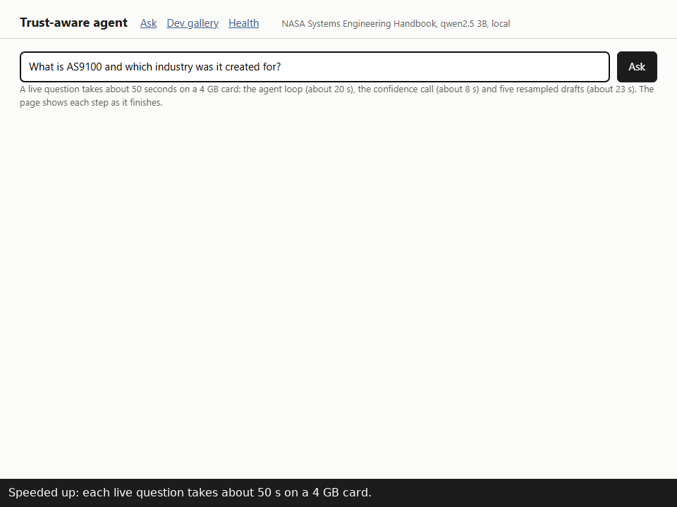

# Trust-aware agent

A question-answering agent that retrieves from a fixed document set, uses
tools, and estimates a calibrated probability that each answer is right before
showing it. When that probability is low it verifies, asks a clarifying
question, or hands the case to a person, and every score comes with a
plain-language breakdown of the signals behind it.

The GIF is speeded up. A live question costs about 50 seconds on a 4 GB
card: the agent loop (retrieval, readings step, draft) about 20 s, the
confidence call about 8 s, and five resampled drafts about 23 s. The
calibrator was fitted with those paid signals in its vector, so the
dashboard runs the system that was measured rather than a cheaper
stand-in. The counterpoint is the project's main finding: the free
signals read from the trace carried more of the usable signal than any of
the paid ones, so a cheaper deployment would start there.

Status: complete. The evaluation is done and the result is negative; see
Results below and docs/report.md. Every number in this file comes from a
committed script output you can repeat.

## Quickstart

You need Python 3.10 or newer, git, and Ollama (https://ollama.com) for the
local model.

    git clone <this repository>
    cd trust-aware-agent
    python -m venv .venv
    .venv\Scripts\activate          # Windows
    source .venv/bin/activate       # macOS or Linux
    pip install -r requirements.txt
    pip install -e . --no-deps
    sh scripts/hooks/install-hooks.sh
    ollama pull qwen2.5:3b-instruct
    python scripts/check_logprobs.py
    pytest

Install from requirements.txt rather than from the package alone. It pins the
CPU build of PyTorch. On Linux the default wheel is the CUDA build, several
gigabytes this project never uses.

The hook install step matters. It copies the commit-msg and pre-push hooks into
.git/hooks, which git does not track. The commit-msg hook strips co-author
trailers and rejects subjects over 60 characters. The pre-push hook refuses to
push unless ALLOW_PUSH=1 is set, so nothing leaves the machine by accident.

The last script confirms that the model provider returns token log
probabilities, which one of the confidence signals depends on.

## Running the dashboard

With Ollama running and the model pulled (ollama pull qwen2.5:3b-instruct):

    python scripts/fetch_corpus.py
    python scripts/build_chunks.py
    python scripts/build_index.py
    python scripts/serve.py

Then open http://127.0.0.1:8000. The health tab says whether Ollama
answers. The dev gallery tab lists the 134 development items with their
outcome, confidence, grade and bucket, read from the committed reports.
The demo GIF is recorded with scripts/demo/record_gif.py, which needs
Playwright (uv pip install playwright; python -m playwright install
chromium); it is not in requirements.txt because the served app does not
need it.

## Running the evaluation

The development-set pipeline, in order: scripts/run_agent.py (traces),
scripts/grade_run.py (grader v13 with the local judge),
scripts/build_features.py with scripts/paid_signals.py (features),
scripts/fit_calibrator.py and scripts/finalize_calibrator.py (the
calibrator), scripts/policy_curve.py and scripts/policy_apply.py (the
thresholds). Every model call is cached under data/cache, so reruns are
cheap. The test split is read by one script, once, at the end; that
script arrives with milestone M8.

## Layout

    src/agent/         base agent, tools, tracing
    src/signals/       one module per confidence signal
    src/calibration/   training, thresholds, persistence
    src/policy/        the four-action router
    src/explain/       score breakdown in plain language
    src/api/           FastAPI app
    src/ui/            dashboard
    data/corpus/       source documents (extracted text; the PDF is fetched)
    data/eval/         labeled question sets, dev and test
    models/            trained calibrator artifacts
    reports/           plots, metrics tables, the evaluation report
    tests/
    scripts/hooks/     git hooks and their install script
    scripts/demo/      the scripted run used for the demo gif
    docs/              layman guide, numbered explainers, decisions

## Results

The result is negative, and it was judged against criteria written down
before the held-out split was read. On the 134 development items the
calibrated probability was a weak but real guide to correctness, AUROC
0.70 [0.61, 0.79] pooled and 0.63 [0.45, 0.80] where bucket and
retrieval were held fixed. On the 100 test items, read once, the pooled
AUROC was 0.66 [0.56, 0.76] and the held-fixed stratum was at chance,
0.49 [0.29, 0.72] on 36 items, too few to resolve either way. The
decision policy tuned on dev withheld correct answers on test: the error
rate among shown answers was 64 [49, 80] percent against a base rate of
56 [43, 70] percent. Two findings held in direction: retrieval decides
most of the outcome (26 of 36 correct with the evidence retrieved, 0 of
10 without), and the free signals read from the agent's trace matched
or beat the paid ones (agreement alone 0.71 [0.60, 0.80], free signals
0.70 [0.59, 0.80], the full vector 0.66 [0.56, 0.76], intervals
overlapping). The grader's labels were checked blind three times; the
signed-off figure is 19 of 20 on real agent outputs.

Full report: docs/report.md. The plain-language version:
docs/layman-guide.md. The choices and why, including the ones that
turned out wrong: docs/decisions.md. The preregistration the test read
was held to: reports/m8-preregistration.md.

## License

MIT. See LICENSE.
