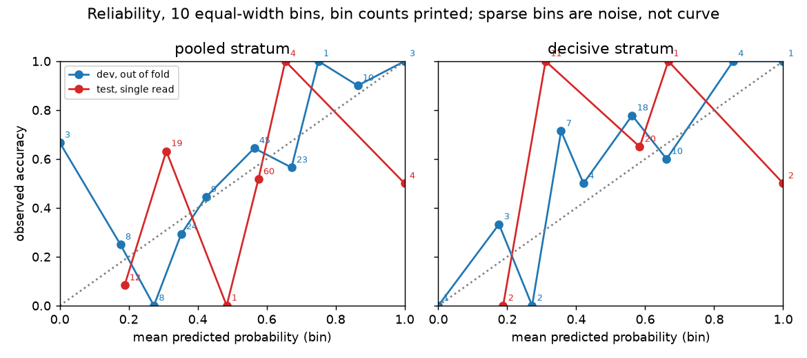
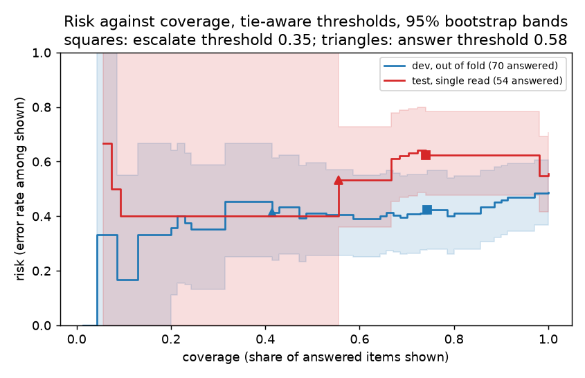
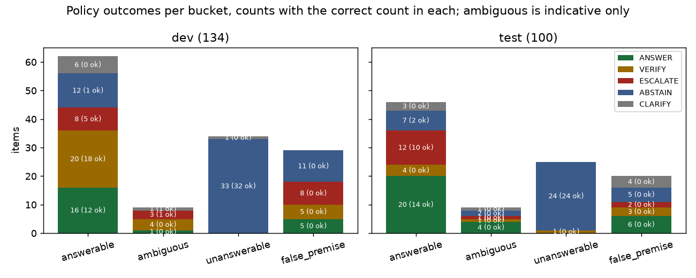
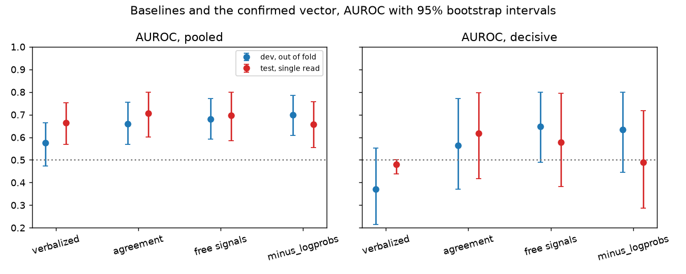

# Trust-aware agent: report

A retrieval question-answering agent over the NASA Systems Engineering
Handbook, on a 3B local model, that outputs a calibrated probability that
its answer is correct and acts on it. Every number carries a 95 percent
bootstrap interval. Dev numbers are out of fold on 134 items; test
numbers come from a single preregistered read of 100 held-out items. The
reader should assume every claim is directional at this data size.

## Abstract

The calibrated confidence did not transfer to the held-out test split,
and the decision policy built on it withheld correct answers. At the
frozen thresholds the error rate among shown answers on test was 64 [49,
80] percent against a base rate of 56 [43, 70] percent. The read landed
in the preregistered "worse" band and is reported as the result, with no
refitting and no second read.

On the development set the confidence separated right from wrong answers
weakly but above chance: AUROC 0.70 [0.61, 0.79] pooled and 0.63 [0.45,
0.80] in the decisive stratum. That stratum is the answerable questions
whose evidence was retrieved. On test the pooled AUROC was 0.66 [0.56,
0.76], inside the dev interval. The decisive-stratum point estimate was
at chance, 0.49 [0.29, 0.72], on 26 correct against 10 wrong; that sample
cannot support a strong claim in either direction. Two findings did hold
direction on test. Retrieval decides most of the outcome: answerable
items were correct 26 of 36 times with the evidence retrieved and 0 of
10 without. And the cheap signals beat the expensive ones. Agreement
alone at 0.71 [0.60, 0.80] pooled and the free trace signals at 0.70
[0.59, 0.80] scored above the confirmed 39-feature vector at 0.66 [0.56,
0.76], with overlapping intervals, the ordering the dev data suggested. A
premise-check step built to move the false-premise bucket off zero made
every bucket worse and is reported as a negative result. The grader's
labels were checked blind three times, most recently at 19 of 20 on real
agent outputs.

## What was built

The agent retrieves eight chunks of the handbook with a small embedding
model and asks the language model whether the question has two readings
the passages answer differently. It drafts an answer, runs a two-operand
calculator when the draft asks for one, and decides among answering,
asking which reading is meant, and saying the handbook does not say.
Every step is written to a trace. Thirty-nine features computed from the
trace and the retrieved text alone, never from the item record, feed a
logistic regression with an isotonic bend, fitted on dev. A policy above
the score shows the answer, flags it, or withholds it and hands the
question to a person. A dashboard serves the measured system at its real
cost, about 50 seconds a question, of which the two paid signals in the
vector (a confidence call and five resampled drafts) take 31 seconds.
Details are in docs/explanations, numbered 00 to 09.

## The data and the grader

Two hundred questions in four buckets: answerable, ambiguous,
unanswerable, and built on a false premise. They were drafted and
verified by language model agents over the handbook and graded by a
language model judge inside a staged grader. Split 100 and 100, stratified by bucket, seed 42; 34
reserve items joined dev later, so dev is 134. The test split was read
by one script, once, after the analysis was preregistered
(reports/m8-preregistration.md). The ambiguous bucket has 9 items in
each split and its numbers are indicative only throughout.

The grader's agreement with the owner was checked blind three times, on
material the owner graded without seeing the judge's key:

| check | drafts | grader | binary agreement |
|---|---|---|---|
| sheet 1, model drafts under three passage conditions | 39 graded of 40 | v7 | 32 of 39 (82 percent) |
| sheet 2, fresh model drafts | 25 | v10 | 20 of 25 (80 percent) |
| final check, real agent outputs from dev, before the test read | 20 | v13, the grader that graded dev and test | 19 of 20 (95 percent) |

The final check is the signed-off figure. Its one binary disagreement is
a false-premise output that states the handbook's correction and then
abstains; the owner graded it CORRECT and the judge WRONG while the
judge's own reason called the interpretation correct. The owner is right
on that item and the grader was not changed after its check. The later
rubric-fidelity reruns of sheets 1 and 2 (38 of 39, 24 of 25) are not
blind and are labelled as such in docs/annotation-guide.md. Twenty items
give a wide interval on 95 percent; it is a check, not a certificate.

## Results: dev and test side by side

The confirmed vector is the 39 features without log-probabilities, with
logistic regression plus isotonic; the artifact and the policy were frozen
by hash before the read. Dev numbers are out of fold (5 folds, seed 42);
test numbers are from the artifact refit on all of dev.

| stratum | dev n (correct) | dev AUROC | test n (correct) | test AUROC |
|---|---|---|---|---|
| pooled | 134 (70) | 0.70 [0.61, 0.79] | 100 (50) | 0.66 [0.56, 0.76] |
| answerable | 62 (36) | 0.62 [0.47, 0.76] | 46 (26) | 0.59 [0.44, 0.74] |
| decisive | 50 (33) | 0.63 [0.45, 0.80] | 36 (26) | 0.49 [0.29, 0.72] |

| stratum | dev Brier | test Brier | dev ECE | test ECE | dev AURC | test AURC |
|---|---|---|---|---|---|---|
| pooled | 0.22 [0.19, 0.25] | 0.25 [0.22, 0.29] | 0.10 [0.07, 0.19] | 0.15 [0.08, 0.24] | 0.31 [0.23, 0.42] | 0.40 [0.27, 0.53] |
| answerable | 0.24 [0.20, 0.29] | 0.28 [0.23, 0.33] | 0.13 [0.08, 0.26] | 0.22 [0.14, 0.36] | 0.31 [0.18, 0.47] | 0.42 [0.20, 0.56] |
| decisive | 0.22 [0.18, 0.26] | 0.31 [0.25, 0.37] | 0.18 [0.12, 0.31] | 0.30 [0.20, 0.44] | 0.24 [0.11, 0.42] | 0.34 [0.10, 0.52] |

Pooled discrimination on test sits inside the dev interval. In the
decisive stratum, where bucket and retrieval are held fixed and the
model's judgement decides, the test point estimate is at chance. With 26
correct against 10 wrong the interval runs from 0.29 to 0.72, so the
sample cannot support a strong claim in either direction. It is not
evidence that the confidence works there, and it is not proof that it
does not. The reliability figure shows why the curve is a sketch: 60 of
the 100 test items land in a single bin.

The preregistered band. Pooled and decisive AUROC point estimates fell
inside the dev intervals. The policy risk at the frozen thresholds was
above the base risk, and the preregistration defined that alone as
"worse". The read is reported in the worse band, and nothing was refit.

## The policy failure

This is the sharpest result in the project and it gets its own section.
The policy showed an answer at or above a probability of 0.58, flagged it
between 0.35 and 0.58, and withheld it below 0.35. The thresholds were
chosen on dev as a coverage choice, because no error target of 10 to 25
percent was reachable there with meaningful coverage.

| answered items | dev (70, 36 correct) | test (54, 24 correct) |
|---|---|---|
| show everything: risk | 49 [37, 60] percent | 56 [43, 70] percent |
| frozen thresholds: coverage | 73 [61, 83] percent | 72 [61, 85] percent |
| frozen thresholds: risk | 41 [28, 55] percent | 64 [49, 80] percent |
| ANSWER band only: coverage | 31 [21, 41] percent | 56 [43, 70] percent |
| ANSWER band only: risk | 45 [25, 67] percent | 53 [36, 73] percent |

On test the policy escalated 12 answerable items, and 10 of them were
correct. Escalation precision was 0.33 and recall 0.17; counting the
flagged band as well, 0.58 and 0.47. The error rate among shown answers
rose from 56 to 64 percent. Two thresholds tuned on 134 dev items did
not transfer, which is exactly the overfitting risk the preregistration
existed to expose. A deployed version of this system would withhold
correct answers. On dev the same policy had moved the error rate from
49 to 41 percent with an interval that already included no effect. The
report said then that the claim waited for the test read. The test read
settled it the other way.

The deployed view counts the agent's own abstentions and clarifications
as shown. It is flattered by the unanswerable bucket, 24 of 25 correct
abstentions on test that no threshold touches, and punished by
false-premise abstentions graded PARTIAL. The answered
population above is the policy's real work.

## The free signals beat the paid ones, on dev and in direction on test

The usual expectation is that sampling-based uncertainty leads and that
a richer vector beats a poorer one. Neither held here.

| system (features) | dev pooled | test pooled | dev decisive | test decisive |
|---|---|---|---|---|
| verbalized confidence alone (3) | 0.58 [0.47, 0.66] | 0.67 [0.57, 0.75] | 0.37 [0.22, 0.55] | 0.48 [0.44, 0.50] |
| sampling agreement alone (7) | 0.66 [0.57, 0.76] | 0.71 [0.60, 0.80] | 0.57 [0.37, 0.77] | 0.62 [0.42, 0.80] |
| free trace signals alone (29) | 0.68 [0.59, 0.77] | 0.70 [0.59, 0.80] | 0.65 [0.49, 0.80] | 0.58 [0.38, 0.79] |
| confirmed vector (39) | 0.70 [0.61, 0.79] | 0.66 [0.56, 0.76] | 0.63 [0.45, 0.80] | 0.49 [0.29, 0.72] |

On test the two smaller systems scored above the confirmed vector, with
overlapping intervals. The free signals, computed from the trace at no
cost, matched agreement, which costs 23 seconds of sampling per question.
On dev the widest gap by label in the decisive stratum was lexical
support, the share of the answer's words found in the best retrieved
chunk: 0.73 for correct answers against 0.49 for wrong ones.
Verbalized confidence clustered at round numbers and inverted inside the
answerable bucket on both splits. This is reported as directional and
confirmed in direction, not as a proven ranking: the intervals overlap
everywhere. Read as a design result: on a small model over a niche
corpus, whether the answer's words are in the passage tells you more
than asking the model how sure it is. Adding the expensive signals to
the vector did not help on held-out data.

## The retrieval confounder

Most of the variance in correctness is retrieval, not judgement.

| bucket | dev, evidence retrieved | dev, not retrieved | test, evidence retrieved | test, not retrieved |
|---|---|---|---|---|
| answerable | 33/50 (66%) | 3/12 (25%) | 26/36 (72%) | 0/10 (0%) |
| unanswerable | 18/19 (95%) | 14/15 (93%) | 15/16 (94%) | 9/9 (100%) |
| false premise | 0/26 (0%) | 0/3 (0%) | 0/18 (0%) | 0/2 (0%) |

Dev is the merged 134 items (reports/features-dev.jsonl strata); the
unanswerable rows show that abstention does not depend on retrieval.
A quarter of dev questions never had their evidence in front of the
model at k=8, and the same k feeds the retrieval-support signals and the
answer itself. The report separates retrieval failure from confidence
failure by reporting the decisive stratum, and the decisive-stratum test
result says the confidence contributed little once retrieval was held
fixed.

## The premise step: a negative result

The false-premise bucket sat at zero correct answers in 20. The obvious
fix, a step that asks the model whether the question assumes something
the passages contradict and gates its claim in code, was built and run
on the whole dev set. It made every bucket worse: correct labels fell
from 54 to 41 of 100, the four rejections it produced on false-premise
items were all wrong, and it added 1,492 seconds to the run. Premise
rejection is a judgement this model does not have at 3B. The step is
off, behind a flag, and the full account is reports/premise-step.md. On
test the bucket stayed at 0 of 20.

## Measurement integrity: four numbers that looked better than they were

The grader, the item pool, the feature vector and a curve each produced
one episode where a number improved for a reason unrelated to what it
claimed to measure. They are reported together because the
pattern is the same and a reader should expect more of it.

1. The v9 judge question. A fourth yes-or-no question added to the judge
   produced YES on true statements and flipped three binary labels on
   the 21 worked examples. It was removed and the support check moved
   into code that reads the corpus. Rule since then: no judge prompt
   change without rerunning the examples.
2. The pool snapshot. A rerun of grader v13 on the first blind sheet
   showed 39 of 39 against 38 of 39 for v12. The one changed row was an
   item that sat as answerable in the pool snapshot and as ambiguous in
   the pool the earlier rerun used; the new rule never touched it. Rule
   since then: a rubric-fidelity rerun grades against the exact pool the
   sheet was drawn from, by a script that takes the snapshot as an
   argument and regenerates nothing.
3. The lp_tokens feature. The full vector beat the vector without
   log-probabilities by 0.04 AUROC pooled and 0.10 in the decisive
   stratum on dev. A post-hoc diagnostic, labelled as such, showed the
   entire gain was lp_tokens, the token count of a draft regenerated with
   log-probabilities on. That text differs from the graded draft on 40
   percent of the stratum. Its coefficient paired with a negative one on
   the response's own length: a length difference between two
   generations, not a confidence signal, and one that would not
   transfer. The log-probability features were dropped and the cost
   stated.
4. The halving figure. An earlier reading said that answering the most
   confident half of the decisive stratum roughly halved the error rate.
   That came from a rank-ordered risk-coverage curve; the isotonic
   probabilities carry many ties and a rank order splits a tie at a point
   no real threshold can reach. The tie-aware curve gave 49 [37, 60] to
   about 40 [26, 57] percent. The earlier figure was wrong and is
   recorded rather than deleted; the authors found it themselves.

The test read adds a fifth entry of a different kind: the preregistered
audit ran regardless of band. Provenance held on every row and the
split's seed and counts matched. Fifteen test items were flagged as
near-duplicates of dev items, 14 by the same-evidence-page rule that
pairs an item with the false-premise item drafted from the same passage.
Removing them changed nothing: pooled AUROC 0.67 [0.56, 0.77], decisive
0.50 [0.28, 0.75].

## Limitations

- Items were drafted and verified by language model agents and graded by
  a language model judge. Human checks are the three blind samples
  above; the signed-off one is 19 of 20 on real outputs.
- Every dev metric describes the out-of-fold calibrator. The shipped
  artifact is refit on all 134 dev items. Its probabilities differ from
  the measured ones by 0.094 on average and up to 0.415 on dev, and its
  calibration was measured only by the test read above. The dashboard
  caps the shown probability at the isotonic step below the top one, so
  nothing displays as certain. The cap is a presentation guard, not a
  fix, and the page says so.
- The explanation layer reports single-feature contributions as the fit
  gives them. The correlated retrieval-score features receive opposite
  signs, so individual coefficients are not interpretable as effects, a
  known consequence of correlated inputs in a linear model. The
  breakdown leads with sums by signal family and states the caveat.
- VERIFY is a flag, not a verification loop. The problem statement's
  tool-based verification is not implemented. Retrieval recall is the
  same at k=10 as at k=8, a second draft mostly repeats the first, and
  the premise step is the precedent for a second pass making things
  worse.
- The false-premise bucket has no positive examples on either split.
  The ambiguous bucket has 9 items per split.
- Sensitivity alternatives not rerun on test: the owner's earlier WRONG
  and CORRECT readings of a bare false-premise abstention, and the
  lenient three-way grade. Both would move the false-premise labels only.
- The paid signals cost about 31 seconds per question on top of the 20
  second loop and did not improve held-out discrimination.

## What would be needed

A larger held-out set before any operating threshold is trusted; the
decisive stratum needs hundreds of items, not 36, to resolve an AUROC
between 0.5 and 0.7. A retrieval stage that gets the evidence in front
of the model more often than three times in four, since that is where
most of the error is. And for the false-premise bucket, a larger model
for the premise judgement or a classifier fine-tuned on
premise-contradiction pairs; both were out of scope on a 4 GB card.

## Reproduction

Everything in this report comes from a script and its committed output:
reports/dev-run-v1b.jsonl and reports/dev-run-reserve.jsonl (agent runs,
graded), reports/features-dev.jsonl, reports/m4-calibration.json,
reports/m5-policy.json, reports/m8-preregistration.md,
reports/m8-test-results.json with its rows and log, and
reports/m8-dev-baselines.json. The figures are drawn by
scripts/make_plots.py from those files. Every model call is cached, so
the runs replay; the test split has been read once and the script that
read it refuses to run again.
